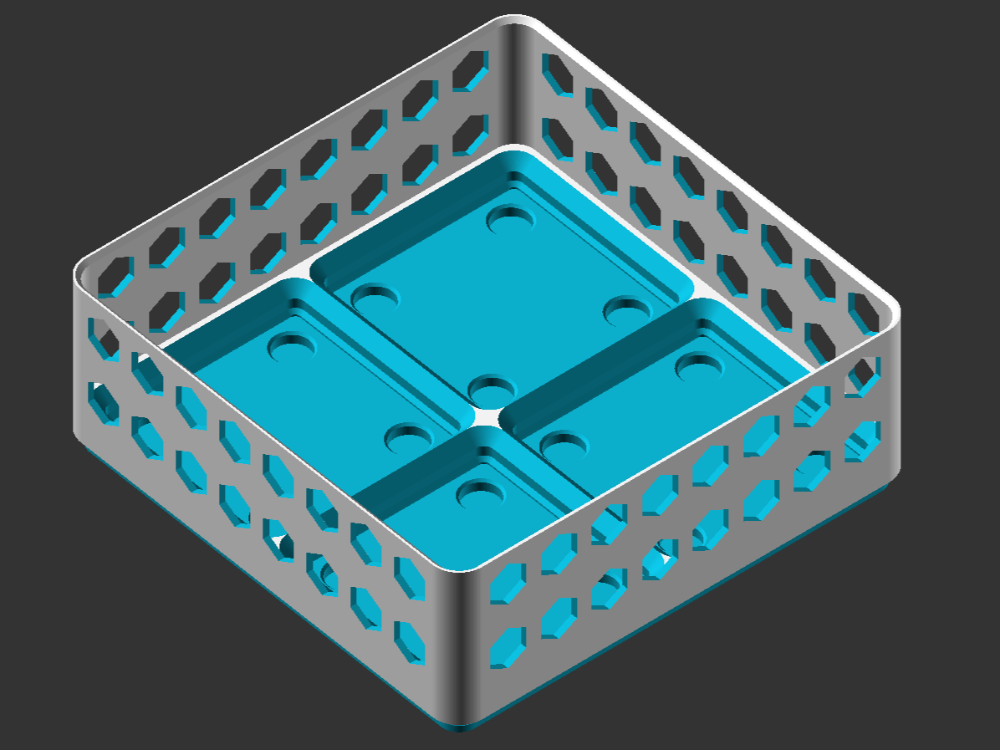

# Gridfinity Basket in OpenSCAD

An openscad script for stackable baskets with a gridfinity base on the inside. Includes many customization options.

The model and various example baskets are also available on makerworld/printables. The site on makerworld also supports the parametric model maker to easily create baskets with different options directly on the site.

[Makerworld site](https://makerworld.com/en/models/1542416-stackable-gridfinity-storage-basket-parametric)

[Printables site](site)

# Customization options
Below is a list of all possible customization options. Although it is possible for most options to set a value outside of the allowed range, in almost all cases it is not a good idea.

### General options
| Parameter           | Description                                              | Type     | Default   | Allowed Values / Range             |
| ------------------- | -------------------------------------------------------- | -------- | --------- | ---------------------------------- |
| `UseMulticolor`     | Add color to the model in three different sections (Can be used together with the openscad .3mf export for multi-color printing) | `bool`   | `false`   | `true`, `false` |
| `UseGridfinityBase` | Include a Gridfinity base inside the basket or keep the bottom flat | `bool`   | `true`    | `true`, `false` |
| `GridSize`          | Grid size in `[X, Y, Z]` format, in multiples of 1U gridfinity units | `array`  | `[2,2,4]` | Integers ≥ 1                       |
| `Padding`           | Padding between edge of Gridfinity base and basket walls (zero padding makes bins with the same size as the basket hard to put in/take out)| `number` | `1`       | `0` to `10`, step `0.1`            |
| `WallThickness`     | Wall thickness of the basket                             | `number` | `1.2`     | `0.4` to `2`, step `0.1`           |
| `AdditionalFloorHeight`       | Additional floor height added to bottom of basket                   | `number` | `1`       | `0` to `3`, step `0.04`            |
| `SolidFloor`        | Make floor solid (requires `FloorHeight > 0`)            | `bool`   | `true`    | `true`, `false`                    |
| `MagnetDiameter` | Diamenter of the magnets. If set to zero, no magnet holes will be created. Increase this value to add some tolerance for magnet insertion. | `number` | `6.5` | `0` to `8`, step `0.05` |
| `MagnetHeight` | Height of the magnets. If set to zero, no magnet holes will be created. Increase this value to add some tolerance for magnet insertion. | `number` | `2.1` | `0` to `4`, step `0.05` |
| `AddMagnetChamfer` | Add additional chamfer around magnet holes to help with insertion | `bool` | `false` | `true`, `false` |

### WallPattern options
| Parameter           | Description                                                     | Type     | Default | Allowed Values / Range   |
| ------------------- | --------------------------------------------------------------- | -------- | ------- | ------------------------ |
| `WallPattern`       | Wall pattern type                                        | `int`    | `1`       | `0: None`, `1: HexGrid`, `2: Grid` |
| `PatternSize`       | Pattern feature size                                            | `number` | `8`     | `4` to `15`, step `0.5`  |
| `PatternEdgeDist`   | Min distance from pattern to start of outer edges              | `number` | `2`     | `0` to `5`, step `0.1`   |
| `PatternMinDist`    | Minimum distance between patterns                               | `number` | `2`     | `0.5` to `5`, step `0.1` |
| `GridPatternRadius` | Outer radius of grid pattern (not applicable to other patterns) | `number` | `3`     | `0` to `10`, step `0.5`  |

### Stacking options
| Parameter     | Description                       | Type     | Default | Allowed Values / Range                    |
| ------------- | --------------------------------- | -------- | ------- | ----------------------------------------- |
| `Standoff`    | Vertical standoff height at the bottom of the basket (the part that sticks into another basket when stacked ontop of eachother)         | `number` | `1`     | `1` to `2`, step `0.1`                    |
| `TopPadding`  | Extra room above bins for stacking | `number` | `2`     | `0.5` to `5`, step `0.1`                  |
| `XYTolerance` | XY-axis tolerance (should keep as-is in most-cases)                | `number` | `0.5`   | `0.2` to `1`, step `0.05`                 |
| `ZTolerance`  | Z-axis tolerance (should keep as-is in most-cases)                 | `number` | `0.25`  | `0.25`, `0.5`, `0.75`, etc. (step `0.25`) |

# Additional tips
- The Grid pattern can be quite fragile. Use a large `PatternMinDist` and possibly a larger `WallThickness`. 
- No need for supports or brim when printing the baskets.

# Example baskets
#### Animation of various settings

#### 3_2_6 Basket with hexpattern and gridfinity base

#### 3_2_4 Basket with gridpattern and without gridfinity floor

#### Two 3_2_6 Hex Baskets stacked on top of each other

#### 5_3_8 Basket with hollow floor and no wall pattern.

#### Optional Magnet holes with the option for additional chamfers

# Acknowledgements
The base generation is inspired and adapted from the [gridfinity-rebuilt-openscad project](https://github.com/kennetek/gridfinity-rebuilt-openscad). 

The general idea is based on the [Gridfinity-baseplate-basket-parametric](https://www.printables.com/model/970197-gridfinity-baseplate-basket-parametric) model by Blaise's Workshop. In comparison to that model, the gridfinity basket here offers much more customization options and various improvements like the support for padding and different wall sizes. 
